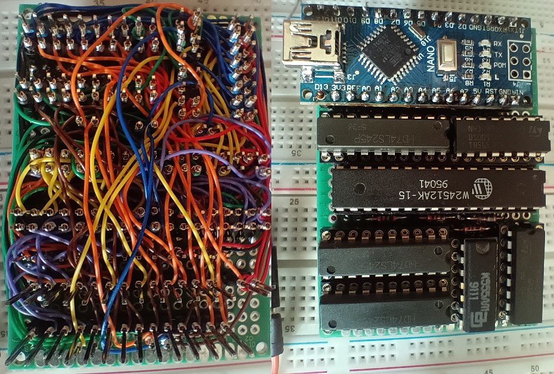

# ROME - a ROM/RAM chip emulator

> This project is currently work in progress. It wasn't yet properly tested.

The emulator consists of Arduino Nano, a static RAM chip and some glue logic that extends arduino's IO abilities and allows to switch control over RAM chip between the arduino and the parallel ROM/RAM interface:

This repository includes:

- [hardware schematics](./hardware), made with KiCad
- description of [protocol](protocol.md) for communication between computer and the device
- [firmware](./firmware/rome) as an Arduino sketch
- [cli tool](software) for interaction with the device, written in Rust

### TODOs:

- Test on hardware with actual computer
- Design a PCB and adapters for actual ROM/RAM chip sockets
